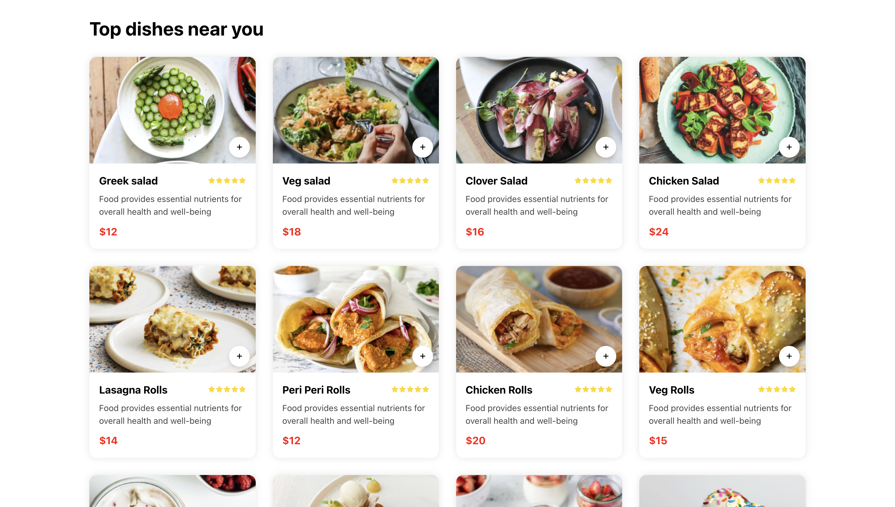
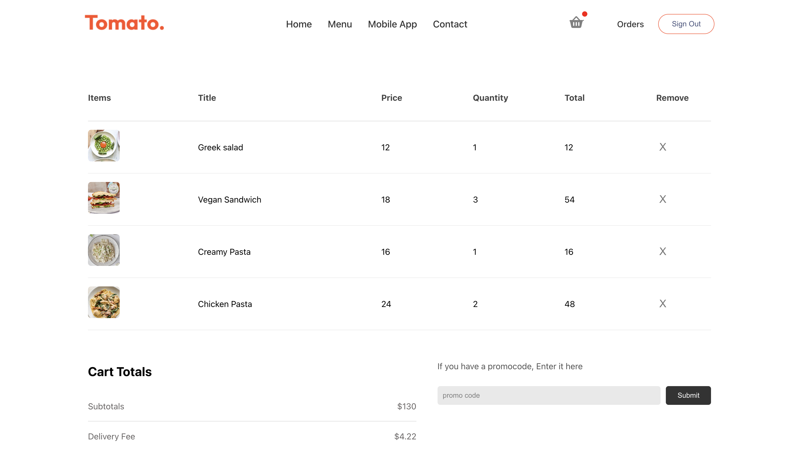
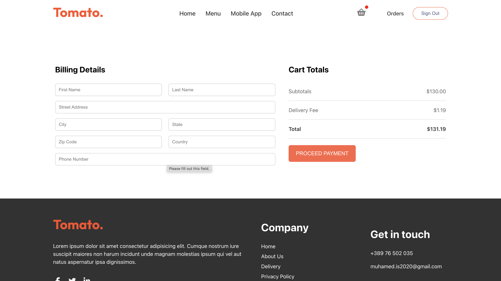
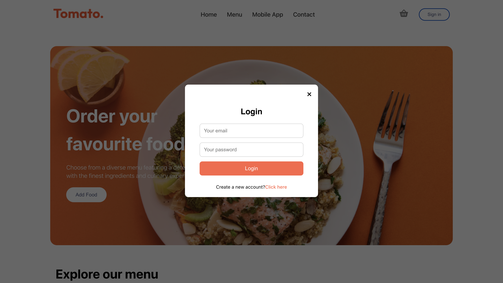

# 🍅 Tomato – Food Delivery Web Application

A modern food ordering web application built with **React, Vite, and Firebase**.  
This project demonstrates frontend architecture, authentication flow, state management, and responsive UI development suitable for internship-level software engineering roles.

🔗 **Live Demo:** https://tomato-food-app-alpha.vercel.app  
📂 **Repository:** https://github.com/muhamed1ismaili101-dot/TomatoFoodApp  

---

## 🚀 Overview

Tomato is a responsive food delivery platform where users can:

- Browse categorized meals
- Add and remove items from a shopping cart
- View real-time cart totals
- Register and authenticate securely
- Complete a checkout process

The application simulates a real-world e-commerce flow and focuses on clean component structure and scalable frontend design.

---

## 🛠 Tech Stack

**Frontend**
- React 19
- Vite
- React Router
- JavaScript (ES6+)
- CSS

**Services**
- Firebase Authentication
- Firebase (data handling)

**Deployment**
- Vercel

---

## ✨ Key Features

- Component-based architecture
- Client-side routing
- Authentication (Login / Signup)
- Dynamic cart logic with automatic total calculation
- Category-based filtering
- Checkout form handling
- Responsive layout
- Optimized production build with Vite

---

## 🧠 Architecture

The application follows a modular React structure:

- Reusable UI components
- Centralized state handling for cart logic
- Separation of page-level views using React Router
- Authentication flow integrated with Firebase
- Clean separation between presentation and logic

This structure allows scalability and future backend/API integration.

---

## 📸 Screenshots

### Home Page


Landing page with featured meals, category navigation, and call-to-action section.  
Built using reusable React components and structured layout composition. 

### Menu Listing


Grid-based food listing with interactive add-to-cart functionality.  
Each item is rendered dynamically and updates application state on interaction.

### Cart Page


Interactive shopping cart with quantity management and automatic total calculation.  
Demonstrates centralized state handling and real-time UI updates.

### Checkout Page


Structured checkout form with order summary and total display.  
Implements controlled inputs and state-driven order calculation.

### Authentication (Login)


Modal-based authentication interface integrated with Firebase.  
Handles conditional rendering based on user authentication state.

---

## 📦 Installation & Setup

Clone the repository:

```bash
git clone https://github.com/muhamed1ismaili101-dot/TomatoFoodApp.git
cd TomatoFoodApp
```

Install dependencies:

```bash
npm install
```

Run development server:

```bash
npm run dev
```

Build for production:

```bash
npm run build
```

---

## 📈 What This Project Demonstrates

- Strong understanding of React fundamentals
- Practical routing and component architecture
- Authentication flow implementation
- State-driven UI updates
- Form handling and validation
- Deployment workflow knowledge

---

## 👨‍💻 Author

Muhamed Ismaili  
Computer Science & Engineering Student – UIST Ohrid  

📧 muhamed.is2020@gmail.com  
🔗 https://www.linkedin.com/in/muhamed-ismaili-4bb8343a9/

---

## 📄 License

Developed for educational and portfolio purposes.
